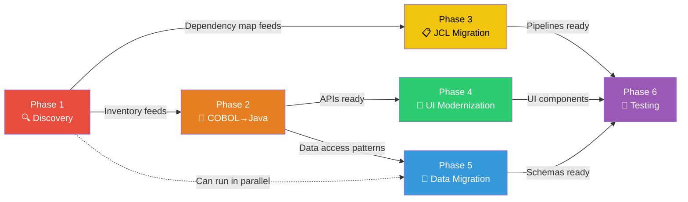
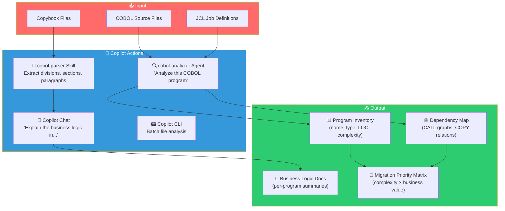
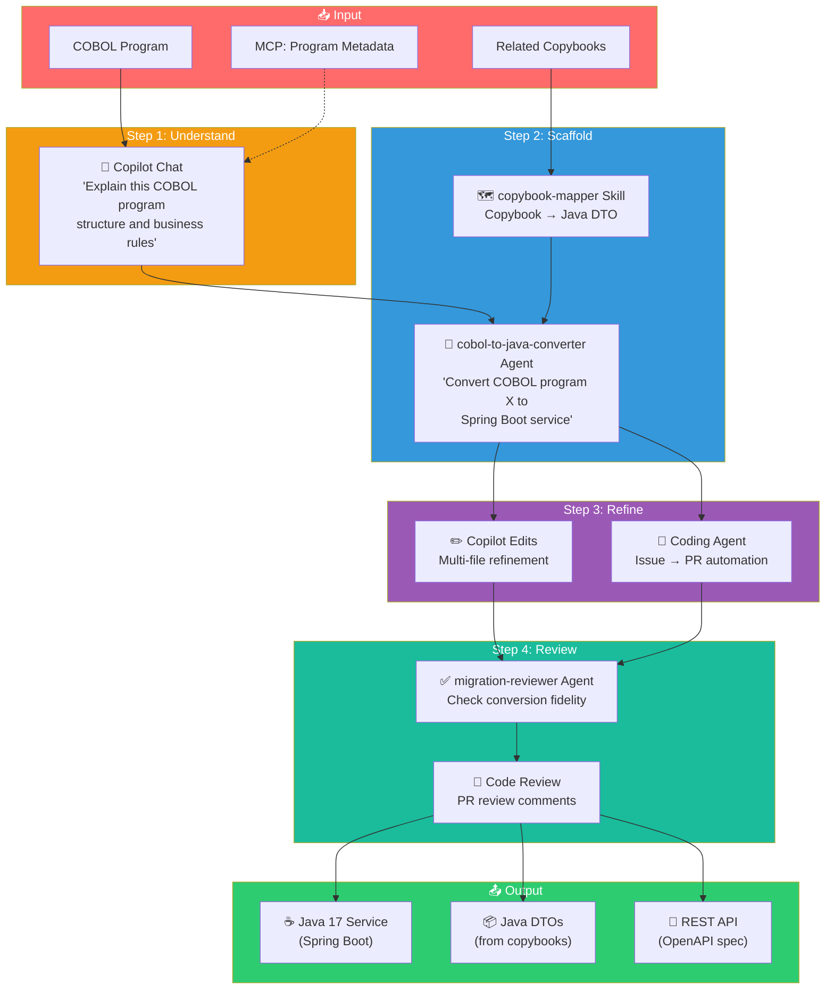
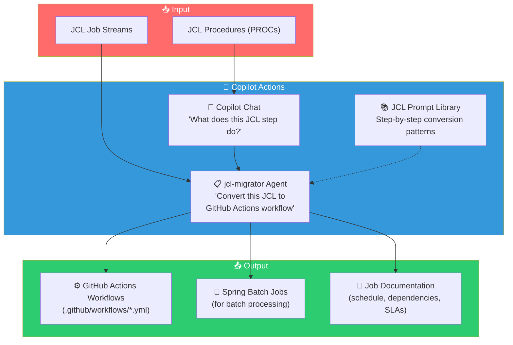
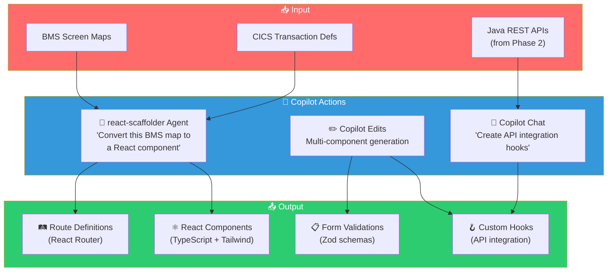
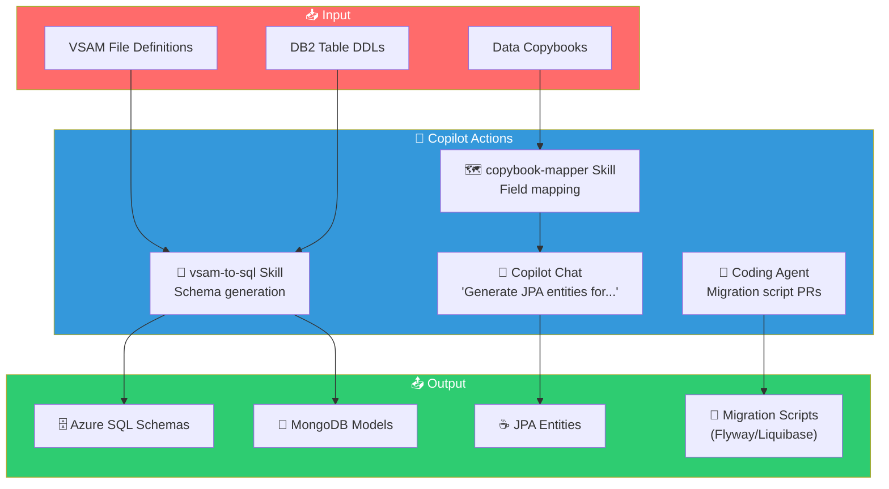
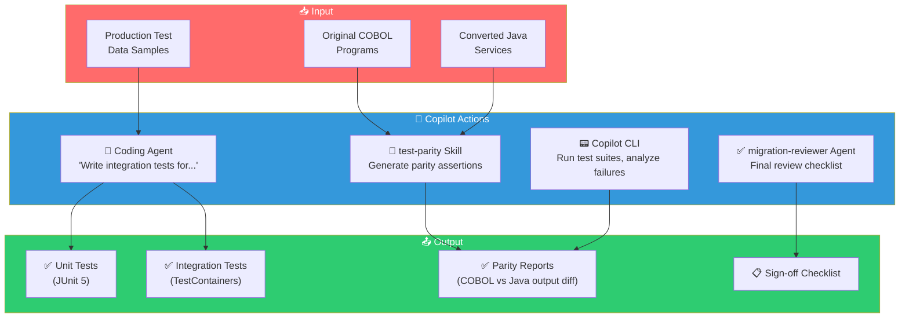
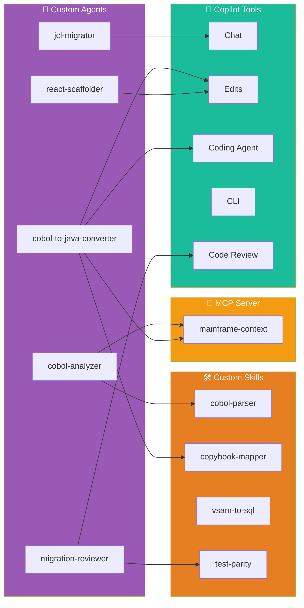

# Architecture Diagrams — GitHub Copilot in Mainframe Modernization

> All diagrams use [Mermaid](https://mermaid.js.org/) syntax. Render in VS Code (Mermaid extension), GitHub markdown preview, or any Mermaid-compatible viewer.

---

## Master Architecture: End-to-End Copilot-Powered Migration

This diagram shows the complete modernization pipeline with every GitHub Copilot touchpoint.

```mermaid
graph TB
    subgraph SOURCE["🖥️ SOURCE: IBM Mainframe z/OS 2.5"]
        COBOL["937 COBOL Programs<br/>3.38M Lines of Code"]
        JCL["15,250 JCL Jobs"]
        BMS["BMS/CICS Screens"]
        VSAM["VSAM Files & DB2"]
        COPYBOOK["COBOL Copybooks"]
    end

    subgraph COPILOT["🤖 GITHUB COPILOT ECOSYSTEM"]
        direction TB
        subgraph AGENTS["Custom Agents"]
            A1["🔍 cobol-analyzer"]
            A2["🔄 cobol-to-java-converter"]
            A3["📋 jcl-migrator"]
            A4["🎨 react-scaffolder"]
            A5["✅ migration-reviewer"]
        end
        subgraph SKILLS["Custom Skills"]
            S1["📖 cobol-parser"]
            S2["🗺️ copybook-mapper"]
            S3["💾 vsam-to-sql"]
            S4["🧪 test-parity"]
        end
        subgraph TOOLS["Copilot Tools"]
            T1["💬 Copilot Chat"]
            T2["✏️ Copilot Edits"]
            T3["🤖 Coding Agent"]
            T4["📟 Copilot CLI"]
            T5["📝 Code Review"]
        end
        subgraph MCP["MCP Server"]
            M1["📊 Mainframe<br/>Context Server"]
        end
        PL["📚 Prompt Library"]
    end

    subgraph TARGET["🎯 TARGET: Modern Stack"]
        JAVA["Java 17<br/>Spring Boot Services"]
        REACT["React 18.2<br/>TypeScript Components"]
        SQL["Azure SQL<br/>Application DB"]
        MONGO["MongoDB<br/>Document Store"]
        GHA["GitHub Actions<br/>CI/CD Pipelines"]
        BATCH["Spring Batch<br/>Job Scheduler"]
    end

    COBOL -->|Phase 1: Analyze| A1
    COPYBOOK -->|Feed context| M1
    COBOL -->|Phase 2: Convert| A2
    JCL -->|Phase 3: Migrate| A3
    BMS -->|Phase 4: Modernize| A4
    VSAM -->|Phase 5: Transform| S3

    A1 -->|Inventory & docs| JAVA
    A2 -->|Converted code| JAVA
    A3 -->|Pipeline configs| GHA
    A3 -->|Batch jobs| BATCH
    A4 -->|UI components| REACT
    S3 -->|Schemas| SQL
    S3 -->|Models| MONGO

    M1 -.->|Context| A1
    M1 -.->|Context| A2
    M1 -.->|Context| A3
    PL -.->|Prompts| T1
    PL -.->|Prompts| T3

    S1 -.->|Parse| A1
    S2 -.->|Map| A2
    S4 -.->|Test| A5

    A5 -->|Review PRs| T5

    style SOURCE fill:#ff6b6b,stroke:#c0392b,color:#fff
    style COPILOT fill:#3498db,stroke:#2980b9,color:#fff
    style TARGET fill:#2ecc71,stroke:#27ae60,color:#fff
    style AGENTS fill:#9b59b6,stroke:#8e44ad,color:#fff
    style SKILLS fill:#e67e22,stroke:#d35400,color:#fff
    style TOOLS fill:#1abc9c,stroke:#16a085,color:#fff
    style MCP fill:#f39c12,stroke:#e67e22,color:#fff
```

---

## Phase Flow: How Phases Connect

---

## Phase 1: Discovery — Copilot Workflow

---

## Phase 2: COBOL → Java Conversion — Copilot Workflow

---

## Phase 3: JCL Migration — Copilot Workflow

---

## Phase 4: UI Modernization — Copilot Workflow

---

## Phase 5: Data Migration — Copilot Workflow

---

## Phase 6: Testing & Validation — Copilot Workflow

---

## Agent & Skill Interaction Map

Shows how custom agents invoke skills and tools:

