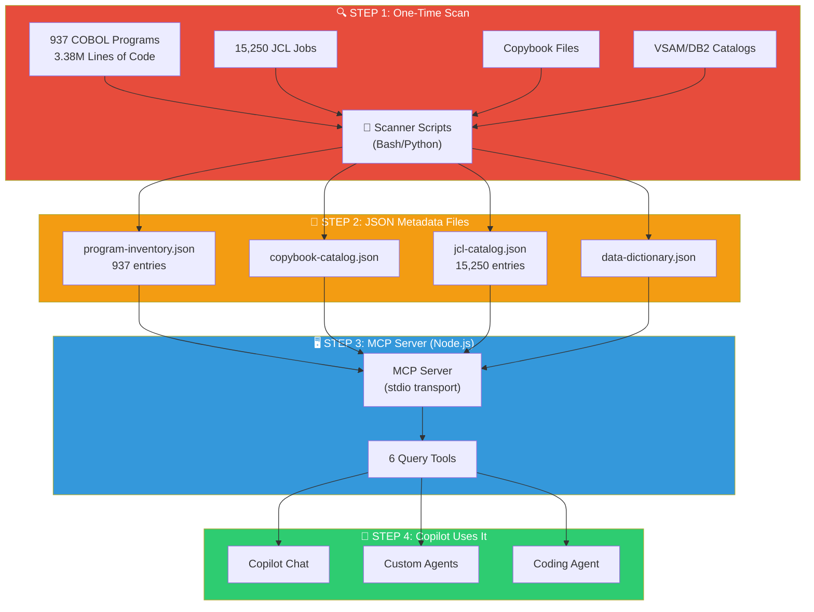

# MCP Server: Mainframe Context Server — Complete Setup & Integration Guide

> **This is the most critical artifact in the kit.** The MCP server is what enables GitHub Copilot to understand a multi-million LOC mainframe codebase — without it, Copilot sees each file in isolation.

---

## Table of Contents
1. [Why MCP is Essential](#why-mcp-is-essential)
2. [Architecture Overview](#architecture-overview)
3. [Prerequisites](#prerequisites)
4. [Step 1: Scan the COBOL Codebase (Build the Metadata)](#step-1-scan-the-cobol-codebase)
5. [Step 2: Create the MCP Server (Node.js Implementation)](#step-2-create-the-mcp-server)
6. [Step 3: Integrate with VS Code](#step-3-integrate-with-vs-code)
7. [Step 4: Integrate with Copilot Coding Agent](#step-4-integrate-with-copilot-coding-agent)
8. [Step 5: Validate It's Working](#step-5-validate-its-working)
9. [Step 6: Keep Metadata Updated](#step-6-keep-metadata-updated)
10. [Tool Reference](#tool-reference)
11. [Troubleshooting](#troubleshooting)

---

## Why MCP is Essential

**The problem:** Copilot's context window can hold ~100K–200K tokens. Your codebase has 3.38 million lines of COBOL. Copilot cannot read it all at once.

**The solution:** The MCP (Model Context Protocol) server acts as Copilot's **external brain** — a searchable index of your entire codebase that Copilot can query on demand.

```
Without MCP:                          With MCP:
┌─────────────────────┐              ┌─────────────────────┐
│ Copilot sees ONE     │              │ Copilot sees ONE     │
│ file at a time       │              │ file at a time       │
│                      │              │       PLUS           │
│ ❌ No idea what      │              │ ✅ Knows what calls  │
│    calls this program│              │    this program      │
│ ❌ No idea which     │              │ ✅ Knows all related │
│    copybooks relate  │              │    copybooks         │
│ ❌ No idea which     │              │ ✅ Knows which JCL   │
│    JCL jobs use it   │              │    jobs execute it   │
│ ❌ No idea about     │              │ ✅ Knows the full    │
│    data dependencies │              │    data flow         │
└─────────────────────┘              └─────────────────────┘
```

---

## Architecture Overview



---

## Prerequisites

| Requirement | Version | Purpose |
|-------------|---------|---------|
| Node.js | 18+ | MCP server runtime |
| npm | 9+ | Package management |
| VS Code | Latest | Copilot integration |
| GitHub Copilot extension | Latest | Chat + agents |
| Bash or Python | 3.10+ | Scanner scripts |
| Access to COBOL source repo | — | The code to scan |

---

## Step 1: Scan the COBOL Codebase

> ⏱️ **Estimated time:** 1–2 hours for initial setup, then the scan runs in minutes.
> This is a **one-time activity** — you only need to do this once, then update incrementally.

### What You're Building

You're scanning the raw source code to extract **metadata** (not the code itself) into 4 JSON files:

| JSON File | What It Contains | How to Extract |
|-----------|-----------------|----------------|
| `program-inventory.json` | Program names, LOC, dependencies | grep + wc on .cbl files |
| `copybook-catalog.json` | Copybook names, which programs use them | grep COPY on .cbl files |
| `jcl-catalog.json` | Job names, steps, programs executed | grep EXEC on .jcl files |
| `data-dictionary.json` | VSAM/DB2 definitions, record sizes | IDCAMS LISTCAT export or grep |

### Scanner Script (Python)

Create this script in your migration repo as `scripts/scan-codebase.py`:

```python
#!/usr/bin/env python3
"""
Mainframe Codebase Scanner
Scans COBOL source files, copybooks, and JCL to produce JSON metadata
for the MCP server.

Usage:
    python scan-codebase.py --cobol-dir src/cobol --jcl-dir src/jcl --output-dir data/
"""

import os
import re
import json
import argparse
from pathlib import Path
from collections import defaultdict

def scan_cobol_program(filepath):
    """Extract metadata from a single COBOL program."""
    with open(filepath, 'r', encoding='utf-8', errors='ignore') as f:
        lines = f.readlines()

    program_id = None
    calls = []
    copybooks = []
    sql_tables = []
    cics_commands = []
    file_assignments = []

    for line in lines:
        # Skip comment lines (column 7 = *)
        if len(line) > 6 and line[6] == '*':
            continue

        text = line[6:72] if len(line) > 6 else line  # COBOL area A+B

        # Extract PROGRAM-ID
        match = re.search(r'PROGRAM-ID\.\s+([\w-]+)', text, re.IGNORECASE)
        if match:
            program_id = match.group(1).upper()

        # Extract CALL statements
        match = re.search(r"CALL\s+['\"]?([\w-]+)['\"]?", text, re.IGNORECASE)
        if match:
            calls.append(match.group(1).upper())

        # Extract COPY statements
        match = re.search(r'COPY\s+([\w-]+)', text, re.IGNORECASE)
        if match:
            copybooks.append(match.group(1).upper())

        # Extract SQL table references
        match = re.search(r'(SELECT|INSERT|UPDATE|DELETE)\s+.*?(FROM|INTO)\s+([\w.]+)',
                          text, re.IGNORECASE)
        if match:
            sql_tables.append(match.group(3).upper())

        # Extract CICS commands
        match = re.search(r'EXEC\s+CICS\s+(\w+)', text, re.IGNORECASE)
        if match:
            cics_commands.append(match.group(1).upper())

        # Extract file assignments
        match = re.search(r"ASSIGN\s+TO\s+['\"]?([\w.-]+)", text, re.IGNORECASE)
        if match:
            file_assignments.append(match.group(1).upper())

    return {
        "programId": program_id or Path(filepath).stem.upper(),
        "fileName": os.path.basename(filepath),
        "linesOfCode": len(lines),
        "calls": list(set(calls)),
        "copybooks": list(set(copybooks)),
        "sqlTables": list(set(sql_tables)),
        "cicsCommands": list(set(cics_commands)),
        "files": list(set(file_assignments)),
        "complexity": calculate_complexity(len(lines), calls, sql_tables, cics_commands),
        "businessDomain": "UNCLASSIFIED",  # Manually classify later
        "migrationStatus": "pending"
    }

def calculate_complexity(loc, calls, sql, cics):
    """Score complexity from 1-5 based on multiple dimensions."""
    score = 0
    score += min(loc // 500, 5)               # LOC: 500 per point, max 5
    score += min(len(calls), 5)               # CALL depth
    score += min(len(sql) * 2, 5)             # SQL complexity
    score += min(len(cics) * 2, 5)            # CICS complexity
    return min(max(round(score / 4), 1), 5)   # Average, clamp 1-5

def scan_jcl_job(filepath):
    """Extract metadata from a single JCL job."""
    with open(filepath, 'r', encoding='utf-8', errors='ignore') as f:
        content = f.read()

    job_name = None
    programs = []
    procs = []
    datasets_in = []
    datasets_out = []

    match = re.search(r'^//([\w]+)\s+JOB\s', content, re.MULTILINE)
    if match:
        job_name = match.group(1)

    for match in re.finditer(r'EXEC\s+PGM=([\w]+)', content, re.IGNORECASE):
        programs.append(match.group(1).upper())

    for match in re.finditer(r'EXEC\s+([\w]+)(?!\s*PGM)', content):
        procs.append(match.group(1).upper())

    for match in re.finditer(r'DSN=([\w.]+)', content, re.IGNORECASE):
        datasets_in.append(match.group(1))

    return {
        "jobName": job_name or Path(filepath).stem.upper(),
        "fileName": os.path.basename(filepath),
        "programs": list(set(programs)),
        "procedures": list(set(procs)),
        "datasets": list(set(datasets_in)),
        "stepCount": len(programs) + len(procs),
        "migrationStatus": "pending"
    }

def build_copybook_catalog(programs):
    """Cross-reference which programs use which copybooks."""
    copybook_usage = defaultdict(list)
    for prog in programs:
        for cpy in prog.get("copybooks", []):
            copybook_usage[cpy].append(prog["programId"])

    return [
        {
            "name": name,
            "usedBy": users,
            "usageCount": len(users)
        }
        for name, users in copybook_usage.items()
    ]

def build_call_graph(programs):
    """Build the calledBy reverse index."""
    called_by = defaultdict(list)
    for prog in programs:
        for target in prog.get("calls", []):
            called_by[target].append(prog["programId"])

    for prog in programs:
        prog["calledBy"] = called_by.get(prog["programId"], [])

    return programs

def main():
    parser = argparse.ArgumentParser(description='Scan mainframe codebase for MCP server')
    parser.add_argument('--cobol-dir', required=True, help='Path to COBOL source directory')
    parser.add_argument('--jcl-dir', required=True, help='Path to JCL source directory')
    parser.add_argument('--output-dir', required=True, help='Output directory for JSON files')
    args = parser.parse_args()

    os.makedirs(args.output_dir, exist_ok=True)

    # --- Scan COBOL programs ---
    print("🔍 Scanning COBOL programs...")
    programs = []
    cobol_dir = Path(args.cobol_dir)
    for ext in ['*.cbl', '*.cob', '*.CBL', '*.COB']:
        for filepath in cobol_dir.rglob(ext):
            prog = scan_cobol_program(str(filepath))
            programs.append(prog)
            print(f"   ✅ {prog['programId']} ({prog['linesOfCode']} LOC, complexity={prog['complexity']})")

    # Build reverse call graph
    programs = build_call_graph(programs)

    # --- Scan JCL jobs ---
    print("\n🔍 Scanning JCL jobs...")
    jcl_jobs = []
    jcl_dir = Path(args.jcl_dir)
    for ext in ['*.jcl', '*.JCL']:
        for filepath in jcl_dir.rglob(ext):
            job = scan_jcl_job(str(filepath))
            jcl_jobs.append(job)
            print(f"   ✅ {job['jobName']} ({job['stepCount']} steps)")

    # --- Build copybook catalog ---
    print("\n🔍 Building copybook catalog...")
    copybook_catalog = build_copybook_catalog(programs)

    # --- Write output files ---
    output_dir = Path(args.output_dir)

    with open(output_dir / 'program-inventory.json', 'w') as f:
        json.dump(programs, f, indent=2)
    print(f"\n📄 program-inventory.json: {len(programs)} programs")

    with open(output_dir / 'copybook-catalog.json', 'w') as f:
        json.dump(copybook_catalog, f, indent=2)
    print(f"📄 copybook-catalog.json: {len(copybook_catalog)} copybooks")

    with open(output_dir / 'jcl-catalog.json', 'w') as f:
        json.dump(jcl_jobs, f, indent=2)
    print(f"📄 jcl-catalog.json: {len(jcl_jobs)} jobs")

    # Data dictionary needs manual input or IDCAMS export
    data_dict_template = [
        {
            "name": "EXAMPLE.VSAM.CLUSTER",
            "type": "VSAM-KSDS",
            "copybook": "EXAMPLE-REC",
            "keyFields": ["EXAMPLE-ID"],
            "recordSize": 250,
            "estimatedRecords": 0,
            "targetDatabase": "Azure SQL",
            "targetTable": "examples",
            "_comment": "REPLACE with actual VSAM/DB2 catalog entries"
        }
    ]
    dict_path = output_dir / 'data-dictionary.json'
    if not dict_path.exists():
        with open(dict_path, 'w') as f:
            json.dump(data_dict_template, f, indent=2)
        print(f"📄 data-dictionary.json: Template created (FILL IN MANUALLY)")

    print(f"\n✅ Scan complete! Metadata files written to {args.output_dir}/")
    print(f"   Total programs: {len(programs)}")
    print(f"   Total JCL jobs: {len(jcl_jobs)}")
    print(f"   Total copybooks: {len(copybook_catalog)}")
    total_loc = sum(p['linesOfCode'] for p in programs)
    print(f"   Total LOC scanned: {total_loc:,}")

if __name__ == '__main__':
    main()
```

### How to Run the Scanner

```bash
# Clone your COBOL source repo (if not already)
git clone https://github.com/your-org/mainframe-source.git

# Run the scanner
python scripts/scan-codebase.py \
  --cobol-dir mainframe-source/src/cobol \
  --jcl-dir mainframe-source/src/jcl \
  --output-dir data/

# Expected output:
# 🔍 Scanning COBOL programs...
#    ✅ CUSTMGMT (1250 LOC, complexity=3)
#    ✅ CUSTINQ (450 LOC, complexity=1)
#    ...
# 📄 program-inventory.json: 937 programs
# 📄 copybook-catalog.json: 312 copybooks
# 📄 jcl-catalog.json: 15250 jobs
# ✅ Scan complete!
```

### Manual Step: Data Dictionary

The data dictionary cannot be fully auto-scanned from source code alone. You need to:

1. **Export VSAM catalog** from the mainframe:
   ```jcl
   //LISTCAT  EXEC PGM=IDCAMS
   //SYSPRINT DD SYSOUT=*
   //SYSIN    DD *
     LISTCAT ENTRIES('PROD.**') ALL
   /*
   ```
2. **Export DB2 catalog**:
   ```sql
   SELECT * FROM SYSIBM.SYSTABLES WHERE CREATOR = 'YOUR_SCHEMA';
   ```
3. Convert the exports to JSON format matching the `data-dictionary.json` schema (see examples below)

### JSON File Schemas & Examples

#### `data/program-inventory.json`
```json
[
  {
    "programId": "CUSTMGMT",
    "fileName": "CUSTMGMT.cbl",
    "linesOfCode": 1250,
    "businessDomain": "Customer Management",
    "complexity": 3,
    "calls": ["CUSTVAL", "ADDRFMT"],
    "calledBy": ["CUSTMENU"],
    "copybooks": ["CUST-REC", "ADDR-REC"],
    "files": ["CUSTOMER-MASTER"],
    "sqlTables": ["CUSTOMER", "ADDRESS"],
    "cicsCommands": ["SEND", "RECEIVE", "READ"],
    "migrationStatus": "pending"
  }
]
```

#### `data/copybook-catalog.json`
```json
[
  {
    "name": "CUST-REC",
    "usedBy": ["CUSTMGMT", "CUSTINQ", "CUSTUPD", "CUSTDEL"],
    "usageCount": 4
  }
]
```

#### `data/jcl-catalog.json`
```json
[
  {
    "jobName": "CUSTBATCH",
    "fileName": "CUSTBATCH.jcl",
    "programs": ["CUSTLOAD", "CUSTREPORT"],
    "procedures": ["STDPROC"],
    "datasets": ["PROD.CUSTOMER.MASTER", "PROD.CUSTOMER.DAILY"],
    "stepCount": 3,
    "migrationStatus": "pending"
  }
]
```

#### `data/data-dictionary.json`
```json
[
  {
    "name": "PROD.CUSTOMER.MASTER",
    "type": "VSAM-KSDS",
    "copybook": "CUST-REC",
    "keyFields": ["CUST-ID"],
    "keyLength": 10,
    "keyOffset": 0,
    "recordSize": 250,
    "estimatedRecords": 5000000,
    "targetDatabase": "Azure SQL",
    "targetTable": "customers"
  }
]
```

---

## Step 2: Create the MCP Server

> ⏱️ **Estimated time:** 30 minutes to set up, or copy-paste from below.

### Project Setup

```bash
# Create the MCP server directory in your migration repo
mkdir -p mcp-servers/mainframe-context
cd mcp-servers/mainframe-context

# Initialize Node.js project
npm init -y

# Install MCP SDK
npm install @modelcontextprotocol/sdk
```

### `mcp-servers/mainframe-context/package.json`
```json
{
  "name": "mainframe-context-mcp",
  "version": "1.0.0",
  "description": "MCP server providing mainframe codebase context to GitHub Copilot",
  "main": "index.js",
  "type": "module",
  "scripts": {
    "start": "node index.js",
    "validate": "node validate.js"
  },
  "dependencies": {
    "@modelcontextprotocol/sdk": "^1.0.0"
  }
}
```

### `mcp-servers/mainframe-context/index.js`

```javascript
#!/usr/bin/env node
/**
 * Mainframe Context MCP Server
 *
 * Provides GitHub Copilot with queryable access to mainframe codebase metadata:
 * - Program inventory (937 COBOL programs)
 * - Copybook catalog
 * - JCL job catalog (15,250 jobs)
 * - Data dictionary (VSAM/DB2 definitions)
 */

import { McpServer } from "@modelcontextprotocol/sdk/server/mcp.js";
import { StdioServerTransport } from "@modelcontextprotocol/sdk/server/stdio.js";
import { z } from "zod";
import { readFileSync } from "fs";
import { resolve } from "path";

// --- Load metadata from JSON files ---
function loadJSON(envVar, defaultPath) {
  const filePath = resolve(process.env[envVar] || defaultPath);
  try {
    return JSON.parse(readFileSync(filePath, "utf-8"));
  } catch (e) {
    console.error(`Warning: Could not load ${filePath}: ${e.message}`);
    return [];
  }
}

const programs = loadJSON("INVENTORY_PATH", "../../data/program-inventory.json");
const copybooks = loadJSON("COPYBOOK_CATALOG_PATH", "../../data/copybook-catalog.json");
const jclJobs = loadJSON("JCL_CATALOG_PATH", "../../data/jcl-catalog.json");
const dataDictionary = loadJSON("DATA_DICTIONARY_PATH", "../../data/data-dictionary.json");

// --- Build indexes for fast lookups ---
const programIndex = Object.fromEntries(programs.map((p) => [p.programId, p]));
const copybookIndex = Object.fromEntries(copybooks.map((c) => [c.name, c]));
const jclIndex = Object.fromEntries(jclJobs.map((j) => [j.jobName, j]));
const dataIndex = Object.fromEntries(dataDictionary.map((d) => [d.name, d]));

// --- Create MCP Server ---
const server = new McpServer({
  name: "mainframe-context",
  version: "1.0.0",
  description: "Provides mainframe codebase context for migration",
});

// ═══════════════════════════════════════
// TOOL 1: get_program_info
// ═══════════════════════════════════════
server.tool(
  "get_program_info",
  "Get detailed information about a COBOL program including dependencies, business domain, complexity, and migration status.",
  { program_id: z.string().describe("COBOL program ID (e.g., 'CUSTMGMT')") },
  async ({ program_id }) => {
    const prog = programIndex[program_id.toUpperCase()];
    if (!prog) {
      return {
        content: [
          {
            type: "text",
            text: `Program '${program_id}' not found in inventory. Available: ${Object.keys(programIndex).slice(0, 20).join(", ")}...`,
          },
        ],
      };
    }
    // Enrich with JCL references
    const jclRefs = jclJobs
      .filter((j) => j.programs?.includes(prog.programId))
      .map((j) => j.jobName);

    return {
      content: [
        {
          type: "text",
          text: JSON.stringify({ ...prog, jclJobs: jclRefs }, null, 2),
        },
      ],
    };
  }
);

// ═══════════════════════════════════════
// TOOL 2: get_copybook_info
// ═══════════════════════════════════════
server.tool(
  "get_copybook_info",
  "Get copybook details including which programs use it and usage count.",
  { copybook_name: z.string().describe("Copybook name (e.g., 'CUST-REC')") },
  async ({ copybook_name }) => {
    const cpy = copybookIndex[copybook_name.toUpperCase()];
    if (!cpy) {
      return {
        content: [
          {
            type: "text",
            text: `Copybook '${copybook_name}' not found. Available: ${Object.keys(copybookIndex).slice(0, 20).join(", ")}...`,
          },
        ],
      };
    }
    return { content: [{ type: "text", text: JSON.stringify(cpy, null, 2) }] };
  }
);

// ═══════════════════════════════════════
// TOOL 3: get_call_graph
// ═══════════════════════════════════════
server.tool(
  "get_call_graph",
  "Get the CALL dependency graph for a program, traversing N levels deep.",
  {
    program_id: z.string().describe("Starting program ID"),
    depth: z.number().default(3).describe("Levels to traverse (default: 3)"),
  },
  async ({ program_id, depth }) => {
    const graph = {};
    const visited = new Set();

    function traverse(progId, currentDepth) {
      if (currentDepth > depth || visited.has(progId)) return;
      visited.add(progId);
      const prog = programIndex[progId.toUpperCase()];
      if (!prog) return;
      graph[progId] = {
        calls: prog.calls || [],
        calledBy: prog.calledBy || [],
        copybooks: prog.copybooks || [],
      };
      for (const target of prog.calls || []) {
        traverse(target, currentDepth + 1);
      }
    }

    traverse(program_id.toUpperCase(), 0);

    return {
      content: [
        {
          type: "text",
          text: JSON.stringify(
            { rootProgram: program_id, depth, nodesTraversed: visited.size, graph },
            null,
            2
          ),
        },
      ],
    };
  }
);

// ═══════════════════════════════════════
// TOOL 4: get_migration_cluster
// ═══════════════════════════════════════
server.tool(
  "get_migration_cluster",
  "Get all programs that should be migrated together with the given program (shared dependencies).",
  { program_id: z.string().describe("Any program in the cluster") },
  async ({ program_id }) => {
    const cluster = new Set();
    const queue = [program_id.toUpperCase()];

    while (queue.length > 0) {
      const current = queue.shift();
      if (cluster.has(current)) continue;
      const prog = programIndex[current];
      if (!prog) continue;
      cluster.add(current);

      // Add programs that share copybooks
      for (const cpy of prog.copybooks || []) {
        const cpyInfo = copybookIndex[cpy];
        if (cpyInfo) {
          for (const user of cpyInfo.usedBy || []) {
            if (!cluster.has(user)) queue.push(user);
          }
        }
      }
      // Add directly called/calling programs
      for (const c of [...(prog.calls || []), ...(prog.calledBy || [])]) {
        if (!cluster.has(c)) queue.push(c);
      }
    }

    const clusterPrograms = [...cluster].map((id) => {
      const p = programIndex[id];
      return p
        ? { programId: p.programId, complexity: p.complexity, loc: p.linesOfCode }
        : { programId: id, complexity: null, loc: null };
    });

    return {
      content: [
        {
          type: "text",
          text: JSON.stringify(
            {
              seedProgram: program_id,
              clusterSize: cluster.size,
              totalLOC: clusterPrograms.reduce((sum, p) => sum + (p.loc || 0), 0),
              programs: clusterPrograms,
            },
            null,
            2
          ),
        },
      ],
    };
  }
);

// ═══════════════════════════════════════
// TOOL 5: search_programs
// ═══════════════════════════════════════
server.tool(
  "search_programs",
  "Search programs by business domain, complexity, migration status, or name pattern.",
  {
    domain: z.string().optional().describe("Business domain filter"),
    complexity_min: z.number().optional().describe("Minimum complexity (1-5)"),
    complexity_max: z.number().optional().describe("Maximum complexity (1-5)"),
    status: z.enum(["pending", "in_progress", "done"]).optional(),
    pattern: z.string().optional().describe("Program name pattern (substring match)"),
    limit: z.number().default(20).describe("Max results to return"),
  },
  async ({ domain, complexity_min, complexity_max, status, pattern, limit }) => {
    let results = programs;

    if (domain) {
      results = results.filter((p) =>
        p.businessDomain?.toLowerCase().includes(domain.toLowerCase())
      );
    }
    if (complexity_min !== undefined) {
      results = results.filter((p) => p.complexity >= complexity_min);
    }
    if (complexity_max !== undefined) {
      results = results.filter((p) => p.complexity <= complexity_max);
    }
    if (status) {
      results = results.filter((p) => p.migrationStatus === status);
    }
    if (pattern) {
      const pat = pattern.toUpperCase();
      results = results.filter((p) => p.programId.includes(pat));
    }

    const limited = results.slice(0, limit).map((p) => ({
      programId: p.programId,
      domain: p.businessDomain,
      complexity: p.complexity,
      loc: p.linesOfCode,
      status: p.migrationStatus,
    }));

    return {
      content: [
        {
          type: "text",
          text: JSON.stringify(
            { totalMatches: results.length, showing: limited.length, results: limited },
            null,
            2
          ),
        },
      ],
    };
  }
);

// ═══════════════════════════════════════
// TOOL 6: get_data_dictionary
// ═══════════════════════════════════════
server.tool(
  "get_data_dictionary",
  "Get the data dictionary entry for a VSAM file or DB2 table, including target database mapping.",
  { name: z.string().describe("VSAM cluster name or DB2 table name") },
  async ({ name }) => {
    const entry = dataIndex[name.toUpperCase()];
    if (!entry) {
      return {
        content: [
          {
            type: "text",
            text: `Data entry '${name}' not found. Available: ${Object.keys(dataIndex).slice(0, 20).join(", ")}...`,
          },
        ],
      };
    }
    return {
      content: [{ type: "text", text: JSON.stringify(entry, null, 2) }],
    };
  }
);

// ═══════════════════════════════════════
// RESOURCES: Provide summary stats
// ═══════════════════════════════════════
server.resource("inventory-summary", "mainframe://summary", async () => {
  const totalLOC = programs.reduce((sum, p) => sum + (p.linesOfCode || 0), 0);
  const byStatus = programs.reduce((acc, p) => {
    acc[p.migrationStatus] = (acc[p.migrationStatus] || 0) + 1;
    return acc;
  }, {});
  const byDomain = programs.reduce((acc, p) => {
    const d = p.businessDomain || "UNCLASSIFIED";
    acc[d] = (acc[d] || 0) + 1;
    return acc;
  }, {});

  return {
    contents: [
      {
        uri: "mainframe://summary",
        mimeType: "application/json",
        text: JSON.stringify(
          {
            totalPrograms: programs.length,
            totalJCLJobs: jclJobs.length,
            totalCopybooks: copybooks.length,
            totalDataEntries: dataDictionary.length,
            totalLinesOfCode: totalLOC,
            migrationStatus: byStatus,
            businessDomains: byDomain,
          },
          null,
          2
        ),
      },
    ],
  };
});

// --- Start the server ---
async function main() {
  const transport = new StdioServerTransport();
  await server.connect(transport);
  console.error("🚀 Mainframe Context MCP Server running (stdio transport)");
  console.error(`   📊 Loaded: ${programs.length} programs, ${jclJobs.length} JCL jobs, ${copybooks.length} copybooks`);
}

main().catch(console.error);
```

---

## Step 3: Integrate with VS Code

### 3a. Add MCP configuration

Create `.vscode/mcp.json` in your migration project:

```json
{
  "servers": {
    "mainframe-context": {
      "type": "stdio",
      "command": "node",
      "args": ["./mcp-servers/mainframe-context/index.js"],
      "env": {
        "INVENTORY_PATH": "./data/program-inventory.json",
        "COPYBOOK_CATALOG_PATH": "./data/copybook-catalog.json",
        "JCL_CATALOG_PATH": "./data/jcl-catalog.json",
        "DATA_DICTIONARY_PATH": "./data/data-dictionary.json"
      }
    }
  }
}
```

### 3b. Install dependencies

```bash
cd mcp-servers/mainframe-context
npm install
```

### 3c. Restart VS Code

After adding the MCP config:
1. Press `Ctrl+Shift+P` → "Developer: Reload Window"
2. Open Copilot Chat
3. You should see "mainframe-context" in the MCP server list

### 3d. Verify in Chat

Type in Copilot Chat:
```
What programs are in the inventory? Use the mainframe context server.
```

Copilot will call `search_programs` and return results from your metadata.

---

## Step 4: Integrate with Copilot Coding Agent

Add to `.github/copilot-setup-steps.yml`:

```yaml
steps:
  - name: Set up Node.js for MCP Server
    uses: actions/setup-node@v4
    with:
      node-version: '18'

  - name: Install MCP Server dependencies
    run: |
      cd mcp-servers/mainframe-context
      npm install

  # The MCP server runs via stdio — Copilot Coding Agent
  # connects to it automatically via the mcp.json config.
  # No need to "start" it as a background service.
```

Also add to `.github/copilot-mcp.json` (Coding Agent MCP config):

```json
{
  "servers": {
    "mainframe-context": {
      "type": "stdio",
      "command": "node",
      "args": ["./mcp-servers/mainframe-context/index.js"]
    }
  }
}
```

---

## Step 5: Validate It's Working

### Quick Validation Script

Create `mcp-servers/mainframe-context/validate.js`:

```javascript
/**
 * Validates that the MCP server data files are present and well-formed.
 * Run: node validate.js
 */
import { readFileSync } from "fs";
import { resolve } from "path";

const files = [
  { name: "program-inventory.json", path: "../../data/program-inventory.json", minEntries: 1 },
  { name: "copybook-catalog.json", path: "../../data/copybook-catalog.json", minEntries: 1 },
  { name: "jcl-catalog.json", path: "../../data/jcl-catalog.json", minEntries: 1 },
  { name: "data-dictionary.json", path: "../../data/data-dictionary.json", minEntries: 0 },
];

let allPassed = true;

for (const file of files) {
  try {
    const data = JSON.parse(readFileSync(resolve(file.path), "utf-8"));
    const count = Array.isArray(data) ? data.length : Object.keys(data).length;
    if (count >= file.minEntries) {
      console.log(`✅ ${file.name}: ${count} entries`);
    } else {
      console.log(`⚠️  ${file.name}: ${count} entries (expected ≥ ${file.minEntries})`);
      allPassed = false;
    }
  } catch (e) {
    console.log(`❌ ${file.name}: ${e.message}`);
    allPassed = false;
  }
}

console.log(allPassed ? "\n✅ All checks passed!" : "\n⚠️  Some checks failed — review above.");
```

### Test in Copilot Chat

Once the server is running, try these queries in Copilot Chat:

```
1. "What information do you have about program CUSTMGMT?"
   → Should call get_program_info and return full metadata

2. "What programs should I migrate together with CUSTMGMT?"
   → Should call get_migration_cluster and return the cluster

3. "Show me all programs with complexity score 4 or higher"
   → Should call search_programs with complexity_min=4

4. "What's the call graph for CUSTMGMT, 2 levels deep?"
   → Should call get_call_graph and return the dependency tree

5. "What VSAM files exist in the data dictionary?"
   → Should call get_data_dictionary
```

---

## Step 6: Keep Metadata Updated

The metadata is **not static** — as programs get migrated, you need to update the status.

### Option A: Manual Update
Edit the JSON files directly:
```json
// In program-inventory.json, change:
"migrationStatus": "pending"
// To:
"migrationStatus": "done"
```

### Option B: Update Script
```bash
# Mark a program as migrated
python scripts/update-status.py --program CUSTMGMT --status done

# Rescan after code changes (incremental)
python scripts/scan-codebase.py --cobol-dir src/cobol --jcl-dir src/jcl --output-dir data/ --incremental
```

### Option C: GitHub Actions Automation
```yaml
# .github/workflows/update-inventory.yml
name: Update Migration Inventory
on:
  pull_request:
    types: [closed]
    branches: [main]

jobs:
  update:
    if: github.event.pull_request.merged == true && contains(github.event.pull_request.labels.*.name, 'migration')
    runs-on: ubuntu-latest
    steps:
      - uses: actions/checkout@v4
      - name: Update migration status
        run: |
          # Extract program name from PR title
          PROGRAM=$(echo "${{ github.event.pull_request.title }}" | grep -oP 'Convert \K\w+')
          # Update status in inventory
          python scripts/update-status.py --program "$PROGRAM" --status done
      - name: Commit updated inventory
        run: |
          git config user.name "Migration Bot"
          git config user.email "bot@migration.local"
          git add data/
          git commit -m "Update migration status: $PROGRAM → done"
          git push
```

---

## Tool Reference (Quick Lookup)

| Tool | Purpose | Example Query in Chat |
|------|---------|----------------------|
| `get_program_info` | Full details on one program | "Tell me about CUSTMGMT" |
| `get_copybook_info` | Copybook usage & details | "Which programs use CUST-REC?" |
| `get_call_graph` | Dependency tree | "Show the call graph for CUSTMGMT" |
| `get_migration_cluster` | Programs to migrate together | "What should I migrate with CUSTMGMT?" |
| `search_programs` | Filter programs by criteria | "Find all high-complexity programs" |
| `get_data_dictionary` | VSAM/DB2 definitions | "What's the schema for CUSTOMER-MASTER?" |

---

## Troubleshooting

### "MCP server not connecting"
1. Check Node.js version: `node --version` (must be 18+)
2. Check the path in `mcp.json` points to the correct `index.js`
3. Restart VS Code after adding/changing `mcp.json`
4. Check VS Code Output panel → "MCP" for error messages

### "Tool returns empty results"
1. Run `node validate.js` to check data files exist and have entries
2. Verify the JSON files are valid: `cat data/program-inventory.json | python -m json.tool`
3. Check the program ID matches exactly (case-insensitive search is built in)

### "Data is stale / migration status not updating"
1. Re-run the scanner: `python scripts/scan-codebase.py ...`
2. Or manually update the JSON files
3. Restart VS Code to reload the MCP server with fresh data

### "Scanner misses some programs"
1. Check file extensions — the scanner looks for `.cbl`, `.cob` (and uppercase)
2. Add additional extensions in the scanner script if needed
3. Some programs may be in library members (PDS) — export them as individual files first

---

## Summary: The MCP Setup Checklist

```
□ Step 1: Run scanner script against COBOL + JCL source
          → Produces 4 JSON files in data/ directory
          → ~1-2 hours first time

□ Step 2: Set up MCP server (npm install in mcp-servers/mainframe-context)
          → Copy index.js from this guide
          → ~30 minutes

□ Step 3: Add .vscode/mcp.json to your project
          → Restart VS Code
          → ~5 minutes

□ Step 4: Add Coding Agent config (.github/copilot-setup-steps.yml)
          → ~5 minutes

□ Step 5: Validate with test queries in Copilot Chat
          → "What do you know about CUSTMGMT?"
          → ~10 minutes

□ Step 6: Set up status update workflow (manual or automated)
          → Optional but recommended
          → ~30 minutes
```

**Total setup time: ~2–3 hours** — then Copilot has full context for the entire 3.38M LOC codebase.
