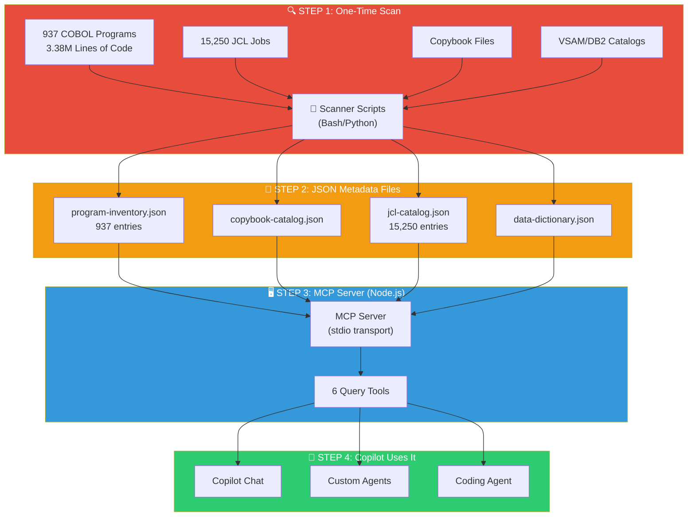

# MCP Server: Mainframe Context Server — Complete Setup & Integration Guide

> **This is the most critical artifact in the kit.** The MCP server is what enables GitHub Copilot to understand a multi-million LOC mainframe codebase — without it, Copilot sees each file in isolation.

---

## Table of Contents
1. [Why MCP is Essential](#why-mcp-is-essential)
2. [Architecture Overview](#architecture-overview)
3. [Prerequisites](#prerequisites)
4. [Step 1: Scan the COBOL Codebase (Build the Metadata)](#step-1-scan-the-cobol-codebase)
5. [Step 2: Create the MCP Server (Node.js Implementation)](#step-2-create-the-mcp-server)
6. [Step 3: Integrate with VS Code](#step-3-integrate-with-vs-code)
7. [Step 4: Integrate with Copilot Coding Agent](#step-4-integrate-with-copilot-coding-agent)
8. [Step 5: Validate It's Working](#step-5-validate-its-working)
9. [Step 6: Keep Metadata Updated](#step-6-keep-metadata-updated)
10. [Tool Reference](#tool-reference)
11. [Troubleshooting](#troubleshooting)

---

## Why MCP is Essential

**The problem:** Copilot's context window can hold ~100K–200K tokens. Your codebase has 3.38 million lines of COBOL. Copilot cannot read it all at once.

**The solution:** The MCP (Model Context Protocol) server acts as Copilot's **external brain** — a searchable index of your entire codebase that Copilot can query on demand.

```
Without MCP:                          With MCP:
┌─────────────────────┐              ┌─────────────────────┐
│ Copilot sees ONE     │              │ Copilot sees ONE     │
│ file at a time       │              │ file at a time       │
│                      │              │       PLUS           │
│ ❌ No idea what      │              │ ✅ Knows what calls  │
│    calls this program│              │    this program      │
│ ❌ No idea which     │              │ ✅ Knows all related │
│    copybooks relate  │              │    copybooks         │
│ ❌ No idea which     │              │ ✅ Knows which JCL   │
│    JCL jobs use it   │              │    jobs execute it   │
│ ❌ No idea about     │              │ ✅ Knows the full    │
│    data dependencies │              │    data flow         │
└─────────────────────┘              └─────────────────────┘
```

---

## Architecture Overview


```mermaid
flowchart TB
    subgraph STEP1["🔍 STEP 1: One-Time Scan"]
        COBOL_SRC["937 COBOL Programs<br/>3.38M Lines of Code"]
        JCL_SRC["15,250 JCL Jobs"]
        CPY_SRC["Copybook Files"]
        VSAM_SRC["VSAM/DB2 Catalogs"]
        SCANNER["📜 Scanner Scripts<br/>(Bash/Python)"]
    end

    subgraph STEP2["💾 STEP 2: JSON Metadata Files"]
        INV["program-inventory.json<br/>937 entries"]
        CPY_CAT["copybook-catalog.json"]
        JCL_CAT["jcl-catalog.json<br/>15,250 entries"]
        DATA_DICT["data-dictionary.json"]
    end

    subgraph STEP3["🖥️ STEP 3: MCP Server (Node.js)"]
        SERVER["MCP Server<br/>(stdio transport)"]
        TOOLS["6 Query Tools"]
    end

    subgraph STEP4["🤖 STEP 4: Copilot Uses It"]
        CHAT["Copilot Chat"]
        AGENTS["Custom Agents"]
        CODING["Coding Agent"]
    end

    COBOL_SRC --> SCANNER
    JCL_SRC --> SCANNER
    CPY_SRC --> SCANNER
    VSAM_SRC --> SCANNER

    SCANNER --> INV
    SCANNER --> CPY_CAT
    SCANNER --> JCL_CAT
    SCANNER --> DATA_DICT

    INV --> SERVER
    CPY_CAT --> SERVER
    JCL_CAT --> SERVER
    DATA_DICT --> SERVER

    SERVER --> TOOLS
    TOOLS --> CHAT
    TOOLS --> AGENTS
    TOOLS --> CODING

    style STEP1 fill:#e74c3c,color:#fff
    style STEP2 fill:#f39c12,color:#fff
    style STEP3 fill:#3498db,color:#fff
    style STEP4 fill:#2ecc71,color:#fff
```

---

## Prerequisites

| Requirement | Version | Purpose |
|-------------|---------|---------|
| Node.js | 18+ | MCP server runtime |
| npm | 9+ | Package management |
| VS Code | Latest | Copilot integration |
| GitHub Copilot extension | Latest | Chat + agents |
| Bash or Python | 3.10+ | Scanner scripts |
| Access to COBOL source repo | — | The code to scan |

---

## Step 1: Scan the COBOL Codebase

> ⏱️ **Estimated time:** 1–2 hours for initial setup, then the scan runs in minutes.
> This is a **one-time activity** — you only need to do this once, then update incrementally.

### What You're Building

You're scanning the raw source code to extract **metadata** (not the code itself) into 4 JSON files:

| JSON File | What It Contains | How to Extract |
|-----------|-----------------|----------------|
| `program-inventory.json` | Program names, LOC, dependencies | grep + wc on .cbl files |
| `copybook-catalog.json` | Copybook names, which programs use them | grep COPY on .cbl files |
| `jcl-catalog.json` | Job names, steps, programs executed | grep EXEC on .jcl files |
| `data-dictionary.json` | VSAM/DB2 definitions, record sizes | IDCAMS LISTCAT export or grep |

### Scanner Script (Python)

The scanner script is included in this repository at `scripts/scan-codebase.py`. Run it with:

**Windows (PowerShell):**
```powershell
python scripts\\scan-codebase.py `
  --cobol-dir C:\\path\\to\\cobol `
  --jcl-dir C:\\path\\to\\jcl `
  --output-dir data\\
```

**Linux/macOS (Bash):**
```bash
python3 scripts/scan-codebase.py \\
  --cobol-dir /path/to/cobol \\
  --jcl-dir /path/to/jcl \\
  --output-dir data/
```

> **Using the samples?** Run the bootstrap script instead — it handles everything:
>
> **Windows:** `.\scripts\bootstrap.ps1`
> **Linux/macOS:** `./scripts/bootstrap.sh`

#### Scanner Implementation

The scanner extracts metadata from COBOL programs and JCL jobs:

```python
# The scanner script has been moved to scripts/scan-codebase.py
# It extracts metadata from COBOL programs and JCL jobs to produce JSON files for the MCP server.
```

### How to Run the Scanner

```bash
# Clone your COBOL source repo (if not already)
git clone https://github.com/your-org/mainframe-source.git

# Run the scanner
python scripts/scan-codebase.py \
  --cobol-dir mainframe-source/src/cobol \
  --jcl-dir mainframe-source/src/jcl \
  --output-dir data/

# Expected output:
# 🔍 Scanning COBOL programs...
#    ✅ CUSTMGMT (1250 LOC, complexity=3)
#    ✅ CUSTINQ (450 LOC, complexity=1)
#    ...
# 📄 program-inventory.json: 937 programs
# 📄 copybook-catalog.json: 312 copybooks
# 📄 jcl-catalog.json: 15250 jobs
# ✅ Scan complete!
```

### Manual Step: Data Dictionary

The data dictionary cannot be fully auto-scanned from source code alone. You need to:

1. **Export VSAM catalog** from the mainframe:
   ```jcl
   //LISTCAT  EXEC PGM=IDCAMS
   //SYSPRINT DD SYSOUT=*
   //SYSIN    DD *
     LISTCAT ENTRIES('PROD.**') ALL
   /*
   ```
2. **Export DB2 catalog**:
   ```sql
   SELECT * FROM SYSIBM.SYSTABLES WHERE CREATOR = 'YOUR_SCHEMA';
   ```
3. Convert the exports to JSON format matching the `data-dictionary.json` schema (see examples below)

### JSON File Schemas & Examples

#### `data/program-inventory.json`
```json
[
  {
    "programId": "CUSTMGMT",
    "fileName": "CUSTMGMT.cbl",
    "linesOfCode": 1250,
    "businessDomain": "Customer Management",
    "complexity": 3,
    "calls": ["CUSTVAL", "ADDRFMT"],
    "calledBy": ["CUSTMENU"],
    "copybooks": ["CUST-REC", "ADDR-REC"],
    "files": ["CUSTOMER-MASTER"],
    "sqlTables": ["CUSTOMER", "ADDRESS"],
    "cicsCommands": ["SEND", "RECEIVE", "READ"],
    "migrationStatus": "pending"
  }
]
```

#### `data/copybook-catalog.json`
```json
[
  {
    "name": "CUST-REC",
    "usedBy": ["CUSTMGMT", "CUSTINQ", "CUSTUPD", "CUSTDEL"],
    "usageCount": 4
  }
]
```

#### `data/jcl-catalog.json`
```json
[
  {
    "jobName": "CUSTBATCH",
    "fileName": "CUSTBATCH.jcl",
    "programs": ["CUSTLOAD", "CUSTREPORT"],
    "procedures": ["STDPROC"],
    "datasets": ["PROD.CUSTOMER.MASTER", "PROD.CUSTOMER.DAILY"],
    "stepCount": 3,
    "migrationStatus": "pending"
  }
]
```

#### `data/data-dictionary.json`
```json
[
  {
    "name": "PROD.CUSTOMER.MASTER",
    "type": "VSAM-KSDS",
    "copybook": "CUST-REC",
    "keyFields": ["CUST-ID"],
    "keyLength": 10,
    "keyOffset": 0,
    "recordSize": 250,
    "estimatedRecords": 5000000,
    "targetDatabase": "Azure SQL",
    "targetTable": "customers"
  }
]
```

---

## Step 2: Create the MCP Server

> ⏱️ **Estimated time:** 30 minutes to set up, or copy-paste from below.

### Project Setup

```bash
# Create the MCP server directory in your migration repo
mkdir -p mcp-servers/mainframe-context
cd mcp-servers/mainframe-context

# Initialize Node.js project
npm init -y

# Install MCP SDK
npm install @modelcontextprotocol/sdk
```

### `mcp-servers/mainframe-context/package.json`
```json
{
  "name": "mainframe-context-mcp",
  "version": "1.0.0",
  "description": "MCP server providing mainframe codebase context to GitHub Copilot",
  "main": "index.js",
  "type": "module",
  "scripts": {
    "start": "node index.js",
    "validate": "node validate.js"
  },
  "dependencies": {
    "@modelcontextprotocol/sdk": "^1.0.0"
  }
}
```

### `mcp-servers/mainframe-context/index.js`

```javascript
// The MCP server implementation has been moved to mcp-servers/mainframe-context/index.js
// It provides GitHub Copilot with queryable access to mainframe codebase metadata.
```

---

## Step 3: Integrate with VS Code

### 3a. Add MCP configuration

Create `.vscode/mcp.json` in your migration project:

```json
{
  "servers": {
    "mainframe-context": {
      "type": "stdio",
      "command": "node",
      "args": ["./mcp-servers/mainframe-context/index.js"],
      "env": {
        "INVENTORY_PATH": "./data/program-inventory.json",
        "COPYBOOK_CATALOG_PATH": "./data/copybook-catalog.json",
        "JCL_CATALOG_PATH": "./data/jcl-catalog.json",
        "DATA_DICTIONARY_PATH": "./data/data-dictionary.json"
      }
    }
  }
}
```

### 3b. Install dependencies

```bash
cd mcp-servers/mainframe-context
npm install
```

### 3c. Restart VS Code

After adding the MCP config:
1. Press `Ctrl+Shift+P` → "Developer: Reload Window"
2. Open Copilot Chat
3. You should see "mainframe-context" in the MCP server list

### 3d. Verify in Chat

Type in Copilot Chat:
```
What programs are in the inventory? Use the mainframe context server.
```

Copilot will call `search_programs` and return results from your metadata.

---

## Step 4: Integrate with Copilot Coding Agent

Add to `.github/copilot-setup-steps.yml`:

```yaml
steps:
  - name: Set up Node.js for MCP Server
    uses: actions/setup-node@v4
    with:
      node-version: '18'

  - name: Install MCP Server dependencies
    run: |
      cd mcp-servers/mainframe-context
      npm install

  # The MCP server runs via stdio — Copilot Coding Agent
  # connects to it automatically via the mcp.json config.
  # No need to "start" it as a background service.
```

Also add to `.github/copilot-mcp.json` (Coding Agent MCP config):

```json
{
  "servers": {
    "mainframe-context": {
      "type": "stdio",
      "command": "node",
      "args": ["./mcp-servers/mainframe-context/index.js"]
    }
  }
}
```

---

## Step 5: Validate It's Working

### Quick Validation Script

The validator is included at `mcp-servers/mainframe-context/validate.js`. Run it to verify your metadata files:

**Windows (PowerShell):**
```powershell
cd mcp-servers\mainframe-context
node validate.js --data-dir ..\..\data
```

**Linux/macOS (Bash):**
```bash
cd mcp-servers/mainframe-context
node validate.js --data-dir ../../data
```

> **Expected output:** `✅ All validation checks passed`

The validator checks that all required JSON files exist and contain valid entries:

```javascript
// The validator script has been moved to mcp-servers/mainframe-context/validate.js
// It checks that all required JSON metadata files exist and contain valid entries.
```

### Test in Copilot Chat

Once the server is running, try these queries in Copilot Chat:

```
1. "What information do you have about program CUSTMGMT?"
   → Should call get_program_info and return full metadata

2. "What programs should I migrate together with CUSTMGMT?"
   → Should call get_migration_cluster and return the cluster

3. "Show me all programs with complexity score 4 or higher"
   → Should call search_programs with complexity_min=4

4. "What's the call graph for CUSTMGMT, 2 levels deep?"
   → Should call get_call_graph and return the dependency tree

5. "What VSAM files exist in the data dictionary?"
   → Should call get_data_dictionary
```

---

## Step 6: Keep Metadata Updated

The metadata is **not static** — as programs get migrated, you need to update the status.

### Option A: Manual Update
Edit the JSON files directly:
```json
// In program-inventory.json, change:
"migrationStatus": "pending"
// To:
"migrationStatus": "completed"
```

### Option B: Update Script
```bash
# Mark a program as migrated
python scripts/update-status.py --program CUSTMGMT --status completed

# Rescan after code changes (incremental)
python scripts/scan-codebase.py --cobol-dir src/cobol --jcl-dir src/jcl --output-dir data/ --incremental
```

### Option C: GitHub Actions Automation
```yaml
# .github/workflows/update-inventory.yml
name: Update Migration Inventory
on:
  pull_request:
    types: [closed]
    branches: [main]

jobs:
  update:
    if: github.event.pull_request.merged == true && contains(github.event.pull_request.labels.*.name, 'migration')
    runs-on: ubuntu-latest
    steps:
      - uses: actions/checkout@v4
      - name: Update migration status
        run: |
          # Extract program name from PR title
          PROGRAM=$(echo "${{ github.event.pull_request.title }}" | grep -oP 'Convert \K\w+')
          # Update status in inventory
          python scripts/update-status.py --program "$PROGRAM" --status completed
      - name: Commit updated inventory
        run: |
          git config user.name "Migration Bot"
          git config user.email "bot@migration.local"
          git add data/
          git commit -m "Update migration status: $PROGRAM → completed"
          git push
```

---

## Tool Reference (Quick Lookup)

| Tool | Purpose | Example Query in Chat |
|------|---------|----------------------|
| `get_program_info` | Full details on one program | "Tell me about CUSTMGMT" |
| `get_copybook_info` | Copybook usage & details | "Which programs use CUST-REC?" |
| `get_call_graph` | Dependency tree | "Show the call graph for CUSTMGMT" |
| `get_migration_cluster` | Programs to migrate together | "What should I migrate with CUSTMGMT?" |
| `search_programs` | Filter programs by criteria | "Find all high-complexity programs" |
| `get_data_dictionary` | VSAM/DB2 definitions | "What's the schema for CUSTOMER-MASTER?" |

---

## Troubleshooting

### "MCP server not connecting"
1. Check Node.js version: `node --version` (must be 18+)
2. Check the path in `mcp.json` points to the correct `index.js`
3. Restart VS Code after adding/changing `mcp.json`
4. Check VS Code Output panel → "MCP" for error messages

### "Tool returns empty results"
1. Run `node validate.js` to check data files exist and have entries
2. Verify the JSON files are valid: `cat data/program-inventory.json | python -m json.tool`
3. Check the program ID matches exactly (case-insensitive search is built in)

### "Data is stale / migration status not updating"
1. Re-run the scanner: `python scripts/scan-codebase.py ...`
2. Or manually update the JSON files
3. Restart VS Code to reload the MCP server with fresh data

### "Scanner misses some programs"
1. Check file extensions — the scanner looks for `.cbl`, `.cob` (and uppercase)
2. Add additional extensions in the scanner script if needed
3. Some programs may be in library members (PDS) — export them as individual files first

---

## Summary: The MCP Setup Checklist

```
□ Step 1: Run scanner script against COBOL + JCL source
          → Produces 4 JSON files in data/ directory
          → ~1-2 hours first time

□ Step 2: Set up MCP server (npm install in mcp-servers/mainframe-context)
          → Copy index.js from this guide
          → ~30 minutes

□ Step 3: Add .vscode/mcp.json to your project
          → Restart VS Code
          → ~5 minutes

□ Step 4: Add Coding Agent config (.github/copilot-setup-steps.yml)
          → ~5 minutes

□ Step 5: Validate with test queries in Copilot Chat
          → "What do you know about CUSTMGMT?"
          → ~10 minutes

□ Step 6: Set up status update workflow (manual or automated)
          → Optional but recommended
          → ~30 minutes
```

**Total setup time: ~2–3 hours** — then Copilot has full context for the entire 3.38M LOC codebase.
